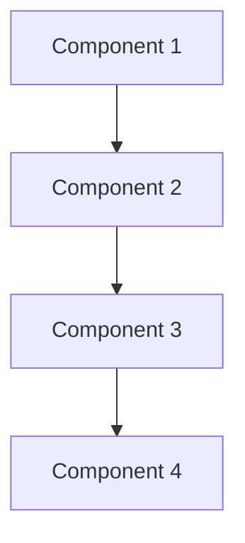

# {{System Name}} Architecture

## Overview
- **Purpose**: 
- **Scope**: 
- **Target Users**: 
- **Key Features**: 

## System Architecture
### High-Level Design


### Components
1. **Component 1**
   - Purpose:
   - Responsibilities:
   - Dependencies:
   - Interfaces:

2. **Component 2**
   - Purpose:
   - Responsibilities:
   - Dependencies:
   - Interfaces:

## Technical Stack
### Frontend
- **Framework**: 
- **State Management**: 
- **UI Library**: 
- **Build Tools**: 

### Backend
- **Runtime**: 
- **Framework**: 
- **Database**: 
- **Caching**: 

### Infrastructure
- **Cloud Provider**: 
- **Containerization**: 
- **Orchestration**: 
- **CI/CD**: 

## Data Flow
### Request Flow
1. Step 1
2. Step 2
3. Step 3

### Data Models
```typescript
interface Model1 {
  field1: string;
  field2: number;
  field3: boolean;
}
```

## Security
- **Authentication**: 
- **Authorization**: 
- **Data Protection**: 
- **Compliance**: 

## Performance
- **Caching Strategy**: 
- **Load Balancing**: 
- **Scaling**: 
- **Monitoring**: 

## Deployment
- **Environments**: 
- **Deployment Process**: 
- **Rollback Strategy**: 
- **Monitoring**: 

## Development Guidelines
- **Code Style**: 
- **Testing Requirements**: 
- **Documentation**: 
- **Review Process**: 

## Future Considerations
- **Scalability**: 
- **Maintenance**: 
- **Evolution**: 
- **Limitations**: 

## References
- [[Related Document 1]]
- [[Related Document 2]]
- External links 